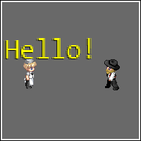

# Racket Game-Engine Multiplayer Sprite Test

This is a multiplayer over tcp test of a 2d sprite-based game-engine in Racket. The sprites are random and only position, direction, and messages are sent over tcp.

## Required Packages
* `game-engine`
* `game-engine-demos-common`

## Usage

To run on the same machine:
* Run `game-engine-tcp-2p-host.rkt` first
  * This will launch a game window at the center left of the screen
* Run `game-engine-tcp-2p-client.rkt` next
  * This will launch a game window a the center right of the screen
* Click on the client window and move the character using the **arrow keys**
* Press **spacebar** to say "Hello!".
* Close each window from the taskbar to properly kill the tcp threads

To run on different machines over a local network:
* Run `game-engine-tcp-2p-host.rkt` on the host machine
* Open `game-engine-tcp-2p-client.rkt` on the client machine and change the HOST-IP to the local ip address of the host machine.
* Click on the client window and move the character using the **arrow keys**
* Press **spacebar** to say "Hello!".
* Close each window from the taskbar to properly kill the tcp threads

## Known Issues
* When using multiple extended displays, the game window will only launch when the mouse is on the primary monitor or to the right of the primary monitor.
* The physical collider is broken due to a bug in game-engine
