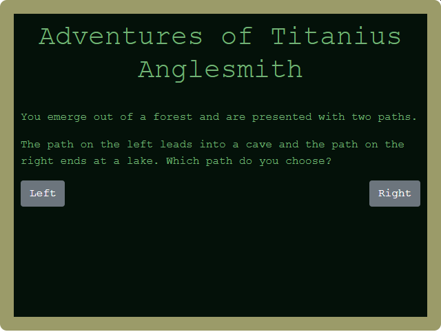
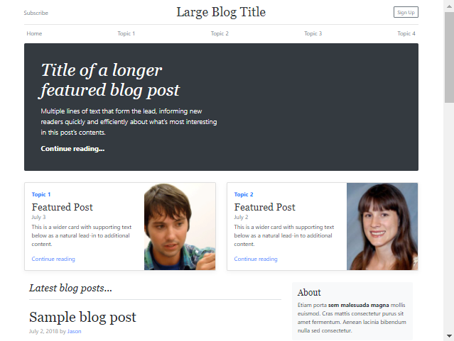
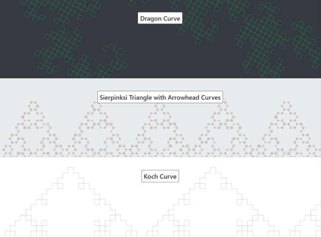
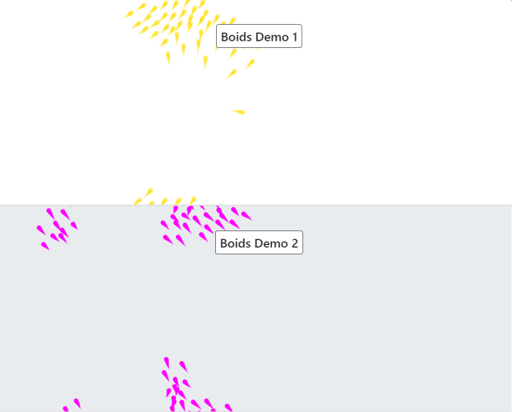

# Racket Web Examples

This is a collection of examples that use the Racket html5-lang, website, and website-js packages.

### html5-lang
[{width=50%}]()[{width=50%}]()

### website-js
[{width=50%}](https://ablender.github.io/fractals/) [{width=50%}](https://ablender.github.io/trees/)
[{width=50%}](https://ablender.github.io/boids/) [{width=50%}](https://ablender.github.io/paint/)

## Required Packages
* `html5-lang`
* `website`
* `website-js`

## Usage

For **html5-lang** examples:
* Run the .rkt file and a web server will start
* Stop racket program to end the web server

For **website** and **website-js** examples:
* Run the .rkt file
 * An `out` folder in the same location will be generated
* From a terminal, navigate to the location of the out folder and run `raco webs`
 * webs is short for website-preview but the typing the full command is optional
 * This will start a web server from the current directory